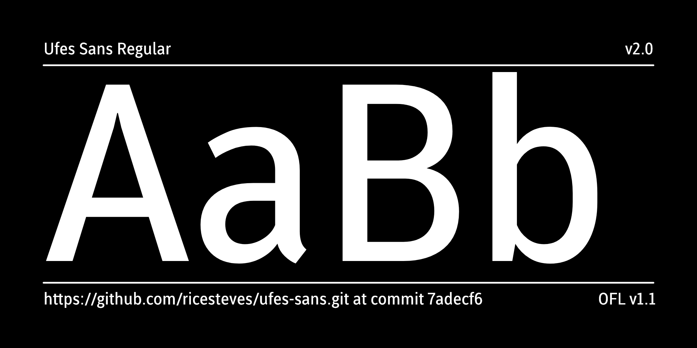
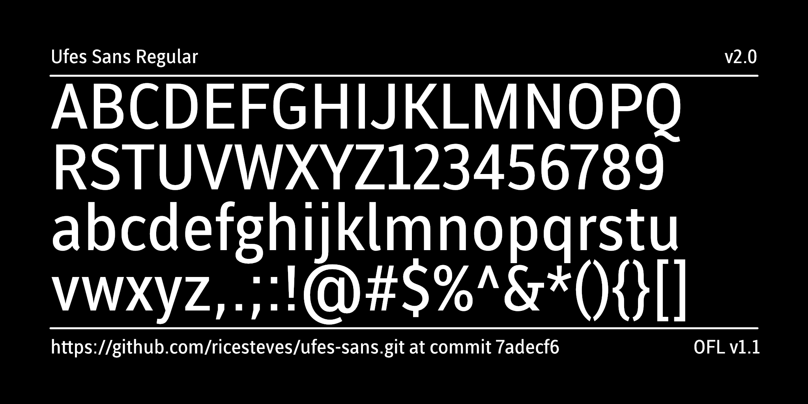

## Ufes Sans

### About the type family

The **Ufes Sans project** began with the goal of creating open-source highly legible fonts for the signage systems of the Universidade Federal do Esp&iacute;rito Santo. Starting in 2013, the project involved students from the undergraduate Design program under the supervision of Professor Ricardo Esteves. After completing its first font (Regular), the family grew with the addition of different weights such as ExtraBold, Bold, SemiBold, and Medium, followed by the first italic font to support bilingual layouts in information displays.

Later, through discussions with the university&rsquo;s Communications Office, the project expanded to integrate the institution&rsquo;s visual identity, resulting in the creation of new variants such as Ufes Sans Thin, Light and Book, and their respective italics. The first version of the font family was released to the public in 2018 and has been widely adopted in the university&rsquo;s visual communication ever since.
In 2023, a new phase of the project engaged volunteer students, focusing on completing the remaining italic weights and adapting the fonts into variable formats. Additionally, significant effort was made to expand support for some Brazilian indigenous languages, such as Guarani Mby&aacute;, Maxakali, Patx&ocirc;h&atilde;, and Old Tupi, addressing specific typographic challenges for these languages.

Thus, over the years, the project evolved from a single signage font into a complete typographic system with 16 static fonts and 2 variable fonts. The release of the second version of the Ufes Sans family, on one hand, enhances resources for Ufes&rsquo; institutional communication, but also creates new digital writing tools for Indigenous peoples in Esp&iacute;rito Santo state and neighboring regions in Brazil. In doing so, the project aims to support these communities in their autonomy regarding typography in their own languages&mdash;considering both the technological environments in which this writing takes place and its diverse end applications, whether in print or digital formats.

### Lead Designer
Ricardo Esteves

### Contributors
Filipe Motta,  
Thais Bronze,  
Cássio Ferreira,  
Ana Quintelato,  
Breno Mello,  
João Magioni,  
Sophia Rossetto, 
Beatriz Feliciano.

* * *

To report issues or contribute, see [github.com/ricesteves/ufes-sans](https://github.com/ricesteves/ufes-sans)  